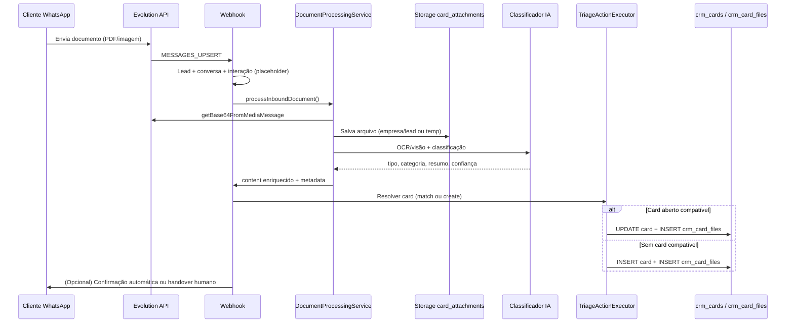

# Planejamento — Documentos WhatsApp → Classificação → Card + Anexo

**Problema:** quando o cliente envia PDF, foto de recibo, nota fiscal ou outro documento pelo WhatsApp, o HuginFlow detecta `type: document` (ou `image`) mas **não baixa, não classifica, não anexa ao card** e a IA recebe conteúdo vazio.

**Objetivo:** receber o documento, identificar o que é, classificar, localizar card aberto compatível (lead + classificação) ou criar um novo já com o anexo.

**Referência interna:** espelhar o pipeline de áudio (`AudioTranscriptionService` + `EvolutionMediaService`) documentado em [planejamento-transcricao-audio-whatsapp.md](./planejamento-transcricao-audio-whatsapp.md).

**Data:** 2026-08-31

---

## 1. Diagnóstico (estado atual)

### O que já existe

| Peça | Situação |
|------|----------|
| `EvolutionProvider.parseWebhook` | Detecta `documentMessage` / `imageMessage`; caption vira `content` (muitas vezes vazio) |
| `EvolutionMediaService` | Só áudio — `getBase64FromMediaMessage` |
| `AiResponseService` | Branch de áudio antes da IA; **sem branch para documento/imagem** |
| `TriageActionExecutor` | Cria/atualiza card por tags `[TRIAGE]` + `[ACTION: CREATE_CARD]` |
| `buildSystemFacts` | Um card aberto por lead (`finalizado=false`, mais recente) — **sem filtro por categoria** |
| `crm_card_files` + bucket `card_attachments` | Upload **manual** no Kanban (`uploadCardFile`) |
| Webhook `/api/webhooks/evolution` | Card eager via roteamento do canal; grava `crm_interacoes` |

### Comportamento real hoje

```
Cliente envia PDF/recibo
  → Evolution MESSAGES_UPSERT
  → type=document, content="" (ou só caption)
  → crm_interacoes gravada sem arquivo
  → IA dispara com message="" → triagem fraca / genérica
  → Operador vê bolha vazia; card não recebe anexo
```

---

## 2. Fluxo alvo (visão de produto)



### Regras de negócio

1. **Identificar** — extrair texto (OCR) e metadados (nome arquivo, mimetype, tamanho).
2. **Classificar** — mapear para taxonomia da empresa (ex.: `comprovante_pagamento`, `nota_fiscal`, `pedido`, `contrato`, `outros`).
3. **Buscar card** — card aberto (`finalizado=false`) do **mesmo lead** onde:
   - `metadados.categoria` (ou `metadados.triage.categoria`) = categoria classificada, **e**
   - opcionalmente mesmo `pipeline_id` / funil inferido da classificação.
4. **Prioridade de match:**
   1. Card já ligado à conversa (`conversa_id = sessao_id`)
   2. Card aberto do lead com mesma categoria + mesmo funil
   3. Card aberto do lead (qualquer categoria) — **configurável por empresa**
   4. Criar novo card no funil/estágio da classificação
5. **Anexar** — registrar em `crm_card_files` + histórico `ATTACHMENT_ADDED` + link em `crm_interacoes.metadata`.
6. **Auditoria** — log de reasoning: por que anexou em X ou criou Y.

---

## 3. Taxonomia e configuração (Schema-Driven)

Evitar hardcode de tipos de documento. Opções (escolher na Fase 0):

| Opção | Prós | Contras |
|-------|------|---------|
| **A — Base de Conhecimento** | Já existe RAG; operador edita | Menos estruturado |
| **B — Tabela `documento_classificacoes`** | Data-driven UI, RBAC | Nova migration |
| **C — Campo JSON em `empresas.metadados`** | Rápido MVP | Menos normalizado |

**Recomendação MVP:** opção **C** ou **B** com seed por tenant:

```json
{
  "documento_tipos": [
    {
      "slug": "comprovante_pagamento",
      "label": "Comprovante de pagamento",
      "funil_id": "...",
      "estagio_id": "...",
      "palavras_chave": ["pix", "comprovante", "transferência"]
    }
  ]
}
```

---

## 4. Arquitetura técnica (componentes novos)

### 4.1 Parser (EvolutionProvider)

Extrair e persistir em `metadata`:

- `media_type`: `document` | `image`
- `mimetype`, `file_name`, `file_length`
- `provider_message_id`, `instance`
- Placeholder user-facing: `📎 Documento recebido — processando…`

### 4.2 `EvolutionMediaService` (generalizar)

- Renomear/estender: `fetchMediaFromMessage(instance, rawPayload, kind: 'audio' | 'document' | 'image')`
- Retorno: `{ buffer, mimetype, fileName }`
- Limite de tamanho (ex.: 10 MB WhatsApp; alinhar com storage)

### 4.3 `DocumentProcessingService` (novo)

Espelha `AudioTranscriptionService`:

| Etapa | Ação |
|-------|------|
| 1 | Download via Evolution |
| 2 | Upload Supabase Storage (`card_attachments` ou bucket `conversation_media` temporário) |
| 3 | Extração de conteúdo (ver 4.4) |
| 4 | Classificação estruturada |
| 5 | Patch `crm_interacoes.content` + `metadata.document` |
| 6 | Retorno para orquestrador: `{ extractedText, classification, storagePath }` |

### 4.4 Extração + classificação (IA)

**Pipeline em duas camadas (recomendado):**

1. **Extração**
   - PDF texto nativo → `pdf-parse` (já no projeto)
   - PDF escaneado / imagem → visão (OpenAI `gpt-4o` vision ou Gemini 2.5 Flash conforme `empresas.ai_provider`)
2. **Classificação** — prompt curto com:
   - Texto extraído (truncado)
   - Taxonomia da empresa
   - Contexto: nome lead, cards abertos, funis

**Structured output (estender `parseTriageTags`):**

```
[DOCUMENT:
tipo=comprovante_pagamento
confianca=0.92
valor_detectado=1500.00
data_detectada=2026-08-30
resumo=Comprovante PIX loja X
]

[TRIAGE: ...]  // reutilizar bloco existente
[ACTION: CREATE_CARD | HANDOVER | ATTACH_ONLY]
```

Nova action sugerida: **`ATTACH_ONLY`** — só anexa em card existente; se não houver match, fallback para `CREATE_CARD`.

### 4.5 `CardDocumentMatcher` (novo)

```typescript
findTargetCard({
  empresaId,
  leadId,
  sessaoId,
  categoria,
  funilId?,
}): Promise<{ cardId, matchReason } | null>
```

Consulta:

```sql
SELECT id FROM crm_cards
WHERE empresa_id = $1 AND lead_id = $2 AND finalizado = false
  AND (conversa_id = $3 OR metadados->>'categoria' = $4)
ORDER BY
  CASE WHEN conversa_id = $3 THEN 0 ELSE 1 END,
  CASE WHEN metadados->>'categoria' = $4 THEN 0 ELSE 1 END,
  created_at DESC
LIMIT 1;
```

### 4.6 `CardAttachmentService` (novo)

Extrair lógica de `uploadCardFile` para uso server-side (service role no webhook):

- `attachFileToCard({ cardId, empresaId, buffer, fileName, mimeType, uploadedBy: null, source: 'whatsapp_inbound', interacaoId })`
- Insert `crm_card_files` + `crm_cards_history`
- Idempotência: `metadata.provider_message_id` — não anexar duas vezes o mesmo WhatsApp message id

### 4.7 Orquestração (`AiResponseService` ou serviço dedicado)

**Ordem proposta:**

```
document/image inbound
  → DocumentProcessingService.process()
  → buildSystemFacts (com texto extraído)
  → CardDocumentMatcher.findTargetCard()
  → se match: attach + update card metadados
  → senão: TriageActionExecutor (CREATE_CARD) + attach
  → resposta IA opcional ("Recebemos seu comprovante e registramos no pedido #...")
```

**Decisão de produto:** documentos podem pular conversa IA longa e ir direto para **handover humano** com card atualizado (config `empresas.documento_auto_handover: true`).

---

## 5. Modelo de dados (migrations)

### 5.1 Estender `crm_interacoes.metadata`

```json
{
  "media_type": "document",
  "mimetype": "application/pdf",
  "file_name": "comprovante.pdf",
  "storage_path": "empresa_id/...",
  "document": {
    "status": "processed",
    "tipo": "comprovante_pagamento",
    "confianca": 0.92,
    "extracted_text_preview": "...",
    "card_file_id": "uuid"
  }
}
```

### 5.2 Estender `crm_card_files` (opcional)

| Coluna | Tipo | Uso |
|--------|------|-----|
| `source` | text | `manual` \| `whatsapp_inbound` |
| `interacao_id` | uuid | FK lógica para `crm_interacoes` |
| `provider_message_id` | text | Idempotência Evolution |

### 5.3 Índice para match

```sql
CREATE INDEX idx_crm_cards_lead_aberto_categoria
  ON crm_cards (empresa_id, lead_id)
  WHERE finalizado = false;
```

---

## 6. UI / Cockpit

| Tela | Mudança |
|------|---------|
| **Chat omnichannel** | Bolha com ícone PDF/imagem, preview, link download (signed URL) |
| **Card modal** | Anexos WhatsApp com badge "Recebido via WhatsApp" |
| **Kanban card** | Indicador 📎 se tem anexo recente inbound |
| **Config empresa** (futuro) | Taxonomia de documentos + funil padrão por tipo |

---

## 7. Segurança e multi-tenancy

- Todo path de storage: `{empresa_id}/{card_id}/...`
- Queries com `organization_id` / `empresa_id` obrigatório
- Service role no webhook; RLS inalterada para UI
- Validar mimetype (bloquear executáveis)
- Antivirus opcional (fase posterior)
- Não enviar documento completo para IA se política LGPD exigir — só OCR local + resumo

---

## 8. Fases de implementação

### Fase 0 — Discovery (2–3 dias)

- [ ] Workshop com NASU/cliente: tipos de documento reais + exemplos (PDF, foto NF, PIX)
- [ ] Definir taxonomia mínima (5–8 tipos)
- [ ] Definir regra de match (estrito vs. flexível)
- [ ] Coletar 10 amostras anonimizadas para teste

### Fase 1 — Pipeline de mídia (3–4 dias)

- [ ] Generalizar `EvolutionMediaService`
- [ ] Placeholder + metadata no parser
- [ ] Download + storage + patch interação
- [ ] UI chat: exibir anexo (sem classificação ainda)
- [ ] Testes com Evolution dev

**Entrega:** documento aparece no chat e no storage.

### Fase 2 — Extração de conteúdo (3–5 dias)

- [ ] PDF texto via `pdf-parse`
- [ ] Imagem/PDF escaneado via vision API
- [ ] Limite de tokens + preview truncado
- [ ] Logs de reasoning / erro

**Entrega:** `content` da interação preenchido com texto útil.

### Fase 3 — Classificação (3–4 dias)

- [ ] Config taxonomia por empresa
- [ ] Prompt + structured output `[DOCUMENT: ...]`
- [ ] Parser estendido
- [ ] Métricas de confiança; fallback `outros`

**Entrega:** sistema sabe *o que* é o documento.

### Fase 4 — Match + anexo em card (4–5 dias)

- [ ] `CardDocumentMatcher`
- [ ] `CardAttachmentService` (server-side)
- [ ] Integração com `TriageActionExecutor` ou orquestrador paralelo
- [ ] Idempotência por `provider_message_id`
- [ ] Histórico no card

**Entrega:** documento no card certo ou card novo criado.

### Fase 5 — IA conversacional + handover (2–3 dias)

- [ ] Resposta automática pós-anexo
- [ ] `ATTACH_ONLY` vs `CREATE_CARD` + `HANDOVER`
- [ ] Modo silêncio / fora de horário respeitados
- [ ] Notificação operador (realtime já existente)

### Fase 6 — Homologação e prod (2–3 dias)

- [ ] Casos de teste automatizados (fixtures)
- [ ] Stress: 5 docs seguidos mesmo lead
- [ ] Doc cutover (migrations + feature flag)
- [ ] Treinamento operadores

**Estimativa total:** **17–25 dias úteis** (1 dev full-time), ou **3–4 sprints** fatiados.

---

## 9. Casos de teste obrigatórios

| # | Cenário | Resultado esperado |
|---|---------|-------------------|
| 1 | PDF comprovante + card Financeiro aberto mesma categoria | Anexa no card existente |
| 2 | PDF comprovante + sem card aberto | Cria card Financeiro + anexo |
| 3 | Imagem NF + card Atendimento aberto (categoria diferente) | Novo card ou regra configurável |
| 4 | Documento duplicado (retry webhook) | Um único anexo (idempotência) |
| 5 | PDF > limite tamanho | Erro amigável + handover humano |
| 6 | Documento ilegível | `tipo=outros`, handover, operador vê arquivo |
| 7 | Cliente manda doc fora do horário | Card criado/anexo ok; mensagem fora horário |
| 8 | Caption + documento | OCR + caption combinados na classificação |

---

## 10. Riscos e mitigações

| Risco | Mitigação |
|-------|-----------|
| OCR errado em foto ruim | Confiança baixa → handover; operador reclassifica |
| Card duplicado (eager webhook + CREATE_CARD) | Matcher prioriza `conversa_id`; executor atualiza existente |
| Custo IA alto (vision) | Só vision se PDF sem texto; cache por hash arquivo |
| LGPD / dados sensíveis | Retenção configurável; não logar texto completo |
| Evolution instável no download | Retry 2x; fila dead-letter em `integration_outbox` |

---

## 11. Feature flags (recomendado)

```env
HUGINFLOW_DOCUMENT_PIPELINE=enabled   # master switch
HUGINFLOW_DOCUMENT_VISION=enabled    # OCR/vision
HUGINFLOW_DOCUMENT_AUTO_CARD=enabled # create/match card
HUGINFLOW_DOCUMENT_AUTO_REPLY=enabled # mensagem automática WhatsApp
```

Permite rollout por empresa em `empresas.metadados.features`.

---

## 12. Dependências externas

- Evolution API: `getBase64FromMediaMessage` (já usado no áudio)
- OpenAI Whisper (áudio) + GPT-4o vision **ou** Gemini 2.5 (visão) — alinhar com `empresa-ai.ts`
- Supabase Storage bucket `card_attachments` (existente)
- Opcional: fila assíncrona se processamento > 15s (Edge Function / outbox)

---

## 13. Fora de escopo (v1)

- Assinatura digital / validação fiscal SEFAZ
- Comparação automática valor com pedido ERP
- Múltiplos documentos em mensagem única ( álbum )
- Reprocessamento manual pela UI (v2)

---

## 14. Próximo passo imediato

1. Validar com stakeholders a **taxonomia NASU** (quais recibos/documentos entram em qual funil).
2. Aprovar **regra de match** (linha 3 da seção 2 — estrito vs. flexível).
3. Iniciar **Fase 1** reutilizando o padrão do áudio.

---

*Documento vivo — atualizar após Fase 0 com taxonomia fechada e estimativa revisada.*
