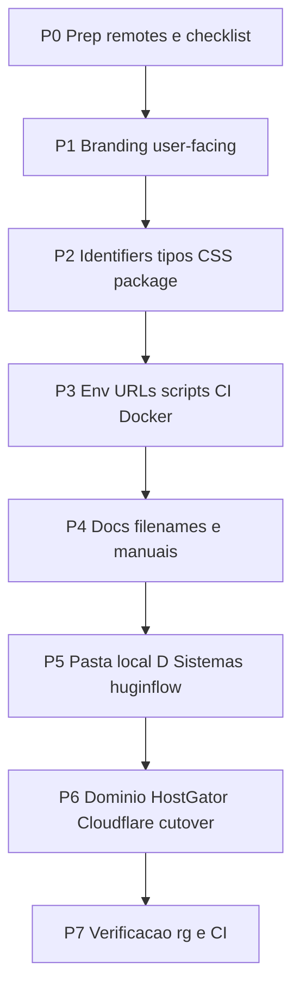

# Plano completo — migrar Ragnar → HuginFlow

**Objetivo:** eliminar referências ao produto Ragnar no código, configs, docs, CI/CD e na **pasta local**, trabalhando no repo [`RN3-Alexandre-Nordin/huginflow`](https://github.com/RN3-Alexandre-Nordin/huginflow).  
**Legado:** repo [`ragnar`](https://github.com/RN3-Alexandre-Nordin/ragnar) permanece no GitHub **sem novos pushes** de produto.  
**Domínio alvo:** `huginflow.com` · **Pasta local alvo:** `D:\Sistemas\huginflow`

---

## Princípios

1. Todo trabalho de rebrand → **push só** `git push huginflow develop` (remote `huginflow`).
2. Remote `origin` (`ragnar`) = emergência/legado; não usar no dia a dia.
3. Renomear a pasta local **depois** do código estar coerente na `develop` e do Cursor poder reabrir o workspace.
4. Contratos/MSA históricos: revisar se “Ragnar” deve permanecer como **nome anterior** em trechos jurídicos.
5. Infra RN3 (`*.rn3.tec.br`, Evolution) **não precisa** ser renomeada; só URLs do **app** e webhooks do produto.



---

## Inventário (baseline)

### Contagem aproximada
Busca `[Rr]agnar|RAGNAR|ragnar.ia.br` em dezenas/centenas de ocorrências em:
- `src/` (UI, tipos, CSS, env defaults)
- `scripts/` (homolog, tunnels)
- `docs/` (manuais, deploy, ambientes)
- `docker-compose*.yml`, `.github/workflows/`
- `package.json` / `package-lock.json`
- `.cursor/mcp.json*`

### Arquivos com “ragnar” no **nome**
| Atual | Novo |
|-------|------|
| `docs/manual-usuario-ragnar.html` | `docs/manual-usuario-huginflow.html` |
| `docs/ambientes-ragnar.html` | `docs/ambientes-huginflow.html` |
| `docs/planejamento-rebrand-huginflow.md` | manter (já HuginFlow) |

### Identifiers TypeScript críticos
| De | Para |
|----|------|
| `RagnarMessage` | `HuginMessage` |
| `RagnarEvent` | `HuginEvent` |
| Prefixo logs `[Ragnar]` / “Ragnar” em strings de sistema | `[HuginFlow]` / HuginFlow |
| Headers/cookies futuros white-label `x-ragnar-*` | `x-hugin-*` |

### Design tokens / Tailwind
| De | Para |
|----|------|
| `--ragnar-blue` (e familia) | `--huginflow-blue` **ou** `--brand-blue` (preferido p/ white-label) |
| `--color-ragnar-*` | `--color-brand-*` / `--color-huginflow-*` |
| Classes `bg-ragnar-blue`, `text-ragnar-*` | equivalentes novos |

Arquivo âncora: `src/app/globals.css` + uso pesado em `src/app/(marketing)/page.tsx`.

### Package / lock
| De | Para |
|----|------|
| `"name": "ragnar"` | `"name": "huginflow"` |

### URLs e env (defaults)
| De | Para |
|----|------|
| `https://app.ragnar.ia.br` | `https://app.huginflow.com` |
| `RAGNAR_WEBHOOK_URL_*` | `HUGINFLOW_WEBHOOK_URL_*` (alias temporário aceitando o antigo) |
| E-mails `*@teste.ragnar.dev` / `teste.ragnar.ia.br` | `*@teste.huginflow.com` (ou manter só em dados de teste legados documentados) |
| Docs `www.ragnar.ia.br` | `www.huginflow.com` / `app.huginflow.com` |

**Manter (infra, não produto):**
- `ragnar-local.rn3.tec.br`, `dev-ragnar.rn3.tec.br` — renomear só se quiser; opcional pós-cutover
- Project refs Supabase (`vujqukqsfwmoezwyuoum`, etc.) — IDs não mudam; labels MCP `supabase-ragnar-*` → `supabase-huginflow-*`

### Docker / CI
| Área | Ocorrências típicas |
|------|---------------------|
| `docker-compose.prod.yml` | Host `app.ragnar.ia.br`, nome de serviço/stack |
| `docker-compose.yml` | nomes locais |
| `.github/workflows/docker-publish.yml` | image name, URLs, envs |

### Pasta / workspace
| De | Para |
|----|------|
| `D:\Sistemas\ragnar` | `D:\Sistemas\huginflow` |
| Workspace Cursor apontando para ragnar | Reabrir pasta `huginflow` |
| Remotes locais | `huginflow` = canônico; `origin` = legado ragnar (opcional remover depois) |

---

## P0 — Preparação (sem mudar comportamento)

1. Confirmar remotes:
   - `huginflow` → `https://github.com/RN3-Alexandre-Nordin/huginflow.git`
   - `origin` → ragnar (não pushar produto)
2. Branch: `develop` tracking `huginflow/develop`
3. Checklist de aceite (`rg` commands) no final deste doc
4. Backup: `develop` já no GitHub huginflow; opcional zip de `D:\Sistemas\ragnar` antes do rename da pasta

---

## P1 — User-facing (marca visível)

**Escopo:** o que usuário/cliente lê na tela e metadados.

| Item | Arquivos âncora |
|------|-----------------|
| Metadata / title | `src/app/layout.tsx`, páginas com `metadata = { title: '...Ragnar...' }` |
| Login | `src/app/(marketing)/login/page.tsx` |
| Landing | `src/app/(marketing)/page.tsx` |
| Cockpit chrome | `src/app/(app)/cockpit/layout.tsx` |
| Ajuda / manual routes | `src/app/(app)/cockpit/ajuda/page.tsx`, `src/app/api/ajuda/manual/route.ts` |
| Logos | `public/logotipo.png`, `src/app/icon.png`, pasta `logos/` |
| Módulo marca | criar `src/lib/branding/platform.ts` (`PLATFORM_NAME`, URLs) |

**Não** renomear tipos TS ainda (P2).

**Aceite:** busca visual + `rg -i "ragnar" src/app --glob '!**/globals.css'` só mostra o que resta planejado.

---

## P2 — Identifiers de código + CSS

1. Renomear tipos em `src/types/omnichannel.ts` e atualizar imports (EvolutionProvider, webhooks, TriageService, AiResponseService, AudioTranscriptionService, etc.).
2. Migrar tokens CSS → `--brand-*` (recomendado) com find-replace controlado; atualizar landing.
3. `package.json` + regenerar lock (`npm install` se necessário).
4. Strings de log/sistema internas.

**Aceite:** `rg "RagnarMessage|RagnarEvent|--ragnar-|ragnar-blue" src` = 0 (exceto changelog/plano).

---

## P3 — Env, URLs, scripts, Docker, CI

1. `src/lib/config/environment.ts` — defaults `app.huginflow.com`
2. `env.production.example`, `env.local.example`
3. Scripts `scripts/supabase/block*.mjs` — APP_URL, webhooks, e-mails de teste
4. `scripts/dev-tunnel*.ps1`, `cloudflared/config.example.yml` — documentar host produto vs infra
5. `docker-compose.prod.yml`, `docker-compose.yml`, `.github/workflows/docker-publish.yml`
6. `next.config.ts` comentários / allowedOrigins
7. Variáveis `RAGNAR_*` → `HUGINFLOW_*` com leitura de fallback uma release

**Aceite:** defaults no código não apontam mais para `app.ragnar.ia.br` (redirect legado só em Traefik/docs).

---

## P4 — Docs e arquivos renomeados ✅ (código em develop; URLs/infra legado até P6)

1. ✅ Rename dos HTML:
   - `manual-usuario-ragnar.html` → `manual-usuario-huginflow.html`
   - `ambientes-ragnar.html` → `ambientes-huginflow.html`
2. ✅ Links: `docs/manual/README.md`, `src/app/api/ajuda/manual/route.ts`, `next.config.ts`, `Dockerfile`
3. ✅ Marca product HuginFlow nos manuais/homolog/MCP docs; **contrato modelo** permanece com “Ragnar” até revisão jurídica humana
4. ✅ `.cursor/skills`, `.cursor/mcp.json(.example)` — `supabase-huginflow-dev|prod`
5. Menções `app.ragnar.ia.br`, `/opt/ragnar`, `ragnar-dev` (Supabase), GHCR/Swarm — **intencionais** até cutover (P6)

**Aceite parcial:** produto/docs de usuário sem marca Ragnar; infra/domínio legado documentados até P6.

---

## P5 — Pasta local `D:\Sistemas\ragnar` → `D:\Sistemas\huginflow`

**Método escolhido:** renomear no lugar (não clone fresh).

### Passo a passo (Windows)

1. Encerrar `npm run dev`, tunnels, processos Node na pasta.
2. Fechar a janela do Cursor neste workspace.
3. No Explorer ou PowerShell (fora da pasta):
   ```powershell
   Rename-Item -Path "D:\Sistemas\ragnar" -NewName "huginflow"
   ```
4. Abrir Cursor em `D:\Sistemas\huginflow`.
5. Verificar remotes:
   ```powershell
   cd D:\Sistemas\huginflow
   git remote -v
   # huginflow → .../huginflow.git  (canônico)
   # origin    → .../ragnar.git      (legado; opcional)
   ```
6. Confirmar tracking: `git branch -vv` → `develop...huginflow/develop`
7. Atualizar atalhos, scripts externos, Terminal profiles, Portainer/CI locais que apontem para o path antigo.
8. Reinstalar deps se necessário: `npm ci`

**Riscos:**
- Extensões/indexing Cursor podem precisar de reload
- Terminals/agents com cwd antigo quebram até reabrir
- Se algo estiver com file lock, fechar processos e tentar de novo

**Aceite:** projeto abre em `D:\Sistemas\huginflow`; `git status` limpo; push funciona para `huginflow`.

---

## P6 — Domínio e cutover (HostGator + Cloudflare)

(Já detalhado no plano white-label; resumido aqui)

1. Registrar `huginflow.com` + e-mail HostGator  
2. NS → Cloudflare; MX cinza; `app`/`*` proxy → Traefik  
3. Traefik hosts novos; SSL Full strict  
4. Evolution setWebhook → `https://app.huginflow.com/api/webhooks/evolution`  
5. Supabase Auth allowlist  
6. 301 `app.ragnar.ia.br` → `app.huginflow.com` por período  
7. Env de produção no deploy (sem commitar secrets)

**Aceite:** login em `app.huginflow.com`; webhook OK; e-mail IMAP HostGator OK.

---

## P7 — Verificação final

Rodar na raiz do projeto (PowerShell):

```powershell
# Deve zerar (ou só permitir allowlist documentada)
rg -i "ragnar" src package.json docker-compose.yml docker-compose.prod.yml .github -g "!**/planejamento*" -g "!**/node_modules/**"
rg -i "ragnar\.ia\.br" . -g "!**/node_modules/**" -g "!**/.next/**" -g "!**/models_available.json"
rg "RagnarMessage|RagnarEvent" src
```

Allowlist sugerida (temporária):
- Comentários “legado / antigo nome Ragnar”
- Redirect Traefik docs
- Repo path historico em commits (imutável)
- Contratos se jurídico exigir

CI: build + lint na `develop` do repo huginflow.

---

## Ordem de execução recomendada (PRs)

| PR | Conteúdo | Push |
|----|----------|------|
| 1 | P1 branding UI + `platform.ts` + logos | `huginflow` |
| 2 | P2 tipos + CSS + package name | `huginflow` |
| 3 | P3 env/scripts/docker/CI | `huginflow` |
| 4 | P4 docs + rename arquivos | `huginflow` |
| — | P5 rename pasta local (manual) | — |
| 5 | P6 cutover domínio (ops + env prod) | deploy |
| — | P7 verificação | — |

**Não misturar** P5 (rename de pasta) com PR aberto no Cursor sem reabrir o workspace.

---

## Fora deste plano / paralelo

- White-label por tenant (`nasu.huginflow.com` + logo cliente) — plano separado  
- Renomear projetos Supabase no dashboard  
- Renomear tunnels `*-ragnar*.rn3.tec.br`  
- Apagar ou arquivar repo GitHub `ragnar` (só depois de meses estáveis)

---

## Critério de “migração 100%”

| Camada | Critério |
|--------|----------|
| UI | Zero marca Ragnar para usuário final |
| Código `src/` | Sem `Ragnar*` / `--ragnar-*` / URLs antigas |
| Tooling | package, compose, Actions = huginflow |
| Docs canônicas | Nomes e links HuginFlow |
| Pasta local | `D:\Sistemas\huginflow` |
| GitHub produto | [`huginflow`](https://github.com/RN3-Alexandre-Nordin/huginflow) |
| Domínio | `*.huginflow.com` em produção |

Quando aprovado, a execução começa por **PR1 (P1)** na `develop` do remote `huginflow`.
