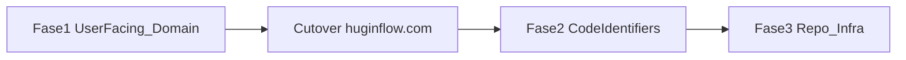

# Plano: Ragnar → HuginFlow (rebrand em fases)

**Status:** planejamento (ainda não executar cutover de domínio)  
**Branch de trabalho:** `develop` (snapshot `e178250`; `main` intacta)  
**Marca:** HuginFlow · **Domínio:** `huginflow.com`

## Decisões

| Item | Decisão |
|------|---------|
| Escopo | Em **3 fases** (user-facing → código → repo/infra) |
| Repo GitHub | **Novo repo** [`huginflow`](https://github.com/RN3-Alexandre-Nordin/huginflow) — **não** renomear/`main` do `ragnar`; `ragnar` permanece congelado como legado |
| Pasta local `d:\Sistemas\ragnar` | Opcional na Fase 3 |
| Relação white-label | Plano paralelo: subdomínio/logo do **cliente** em cima da marca HuginFlow |

## Inventário (hoje)

- Copy/UI: login, landing, cockpit, dezenas de `metadata.title` com `\| Ragnar`
- Tokens CSS: `--ragnar-*` / `bg-ragnar-blue` em `src/app/globals.css` + landing
- Tipos: `RagnarMessage`, `RagnarEvent` (`src/types/omnichannel.ts`)
- URLs: `app.ragnar.ia.br` em `environment.ts`, docker-compose, scripts homolog
- Package: `"name": "ragnar"`
- Docs/manuais com “ragnar” no filename e no corpo
- Assets: `public/logotipo.png` (+ pasta local não commitada `logos/`)

---

## Fase 1 — User-facing + domínio (fazer primeiro)

**Objetivo:** usuário vê HuginFlow; URLs usam `huginflow.com`.  
**Não fazer ainda:** renomear `RagnarMessage`, repo GitHub, pasta do projeto.

### 1.1 Módulo de marca / domínio

- Criar `src/lib/branding/platform.ts` (ou estender `src/lib/config/environment.ts`):
  - `PLATFORM_NAME = 'HuginFlow'`
  - `PLATFORM_ROOT_DOMAIN` via env (`huginflow.com`)
  - `getAppPublicUrl()`, `getTenantAppUrl(slug)`
- Atualizar defaults que hoje apontam para `app.ragnar.ia.br`
- `env.production.example` / `env.local.example`: `NEXT_PUBLIC_APP_URL=https://app.huginflow.com`

### 1.2 UI e metadata

| Área | Arquivos | Ação |
|------|----------|------|
| Metadata root | `src/app/layout.tsx` | title/description HuginFlow |
| Login | `src/app/(marketing)/login/page.tsx` | copy + logo |
| Landing | `src/app/(marketing)/page.tsx` | rebrand + discurso Business OS / workflows |
| Cockpit | `src/app/(app)/cockpit/layout.tsx` | logo, alt, labels |
| Títulos de páginas | busca `\| Ragnar` / `Ragnar CRM` | `\| HuginFlow` |
| Logo | `public/logotipo.png`, `logos/` | assets HuginFlow |
| Strings | “Agente Ragnar”, “conta Ragnar”, etc. | HuginFlow |
| CSS (mínimo Fase 1) | `globals.css` | aliases `--huginflow-*` = valores atuais; classes antigas ainda funcionam |

### 1.3 Domínio e deploy (com HostGator + Cloudflare)

1. Comprar domínio + e-mail no HostGator  
2. NS → Cloudflare; MX cinza (HostGator); `app` + `*` laranja → Traefik  
3. Traefik / `docker-compose.prod.yml`: hosts `app.huginflow.com` (+ wildcard)  
4. Evolution webhook → `https://app.huginflow.com/api/webhooks/evolution`  
5. Supabase Auth: allowlist novo domínio  
6. 301 `app.ragnar.ia.br` → `app.huginflow.com` (janela de convivência)

### 1.4 Docs que bloqueiam operação

Atualizar na Fase 1: `docs/deploy-vps-github-actions.md`, `docs/homologacao/README.md`, trechos críticos de ambientes. Manuais HTML longos podem ser batch na Fase 2/3.

### Aceite Fase 1

- [ ] Login/cockpit/landing sem marca Ragnar visível (exceto menção legal/histórica se precisarem)
- [ ] App responde em `app.huginflow.com`
- [ ] Webhook e Auth no domínio novo
- [ ] `main` ainda sem merge até validar em `develop`/prod canary

---

## Fase 2 — Identifiers de código

**Quando:** após cutover estável (ou em paralelo seguro na `develop` sem quebrar prod antiga).

| De | Para (sugestão) |
|----|-----------------|
| `RagnarMessage` / `RagnarEvent` | `HuginMessage` / `HuginEvent` (ou `PlatformMessage`) |
| Headers/cookies `x-ragnar-*` / `ragnar_` | `x-hugin-*` / `hugin_` |
| `--ragnar-*` / `ragnar-blue` | `--brand-*` ou `--huginflow-*` + limpar aliases |
| `package.json` name | `huginflow` |
| Scripts homolog `*.ragnar.ia.br` | `*.huginflow.com` |
| Logs `[Ragnar]` | `[HuginFlow]` |

Arquivos-chave: `src/types/omnichannel.ts`, webhooks, providers, `AiResponseService`, `TriageService`, landing (classes Tailwind).

### Aceite Fase 2

- [ ] `rg -i ragnar src/` residual só em redirects/legados documentados
- [ ] CI `develop` verde

---

## Fase 3 — Repo, pastas e infra (depois)

1. Renomear GitHub `ragnar` → `huginflow`; atualizar Actions/clone/docs  
2. Renomear arquivos: `manual-usuario-ragnar.html`, `ambientes-ragnar.html`, etc.  
3. Imagens Docker / stack Portainer: tags `ragnar` → `huginflow` (período com tags duplas)  
4. Pasta local do workspace (opcional)  
5. **Manter** hostnames de infra RN3 (`*.rn3.tec.br`, tunnels) — não precisam se chamar HuginFlow  

### Aceite Fase 3

- [ ] Repo + imagens canônicas HuginFlow  
- [ ] `ragnar.ia.br` só como redirect legado  

---

## Ordem prática sugerida

1. Comprar `huginflow.com` + e-mail HostGator + Cloudflare  
2. Executar **Fase 1** em PRs na `develop`  
3. Validar NASU / login em `app.huginflow.com`  
4. Cutover + 301  
5. **Fase 2** (código)  
6. **Fase 3** (repo) após 1–2 semanas estáveis  

## Riscos

- Contratos/MSA históricos: revisar se “Ragnar” deve permanecer como nome anterior do produto  
- Webhook Evolution e Auth devem mudar no **mesmo** momento do cutover  
- Projetos Supabase podem continuar com ref “ragnar” no dashboard (baixo valor renomear)  
- White-label do cliente (slug/logo) continua no plano separado; HuginFlow é a marca da **plataforma** (fallback)

## Não confundir

| Plano | Escopo |
|-------|--------|
| **Este** | Nome do produto plataforma Ragnar → HuginFlow |
| **White-label** | `nasu.huginflow.com` + logo da empresa cliente |
