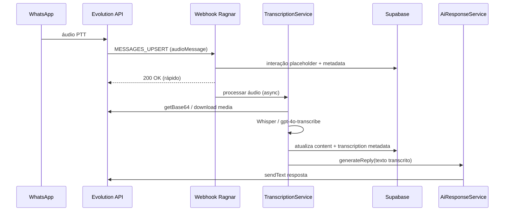

# Planejamento — Transcrição de áudio WhatsApp antes da IA

**Problema:** quando o cliente envia áudio (PTT) no WhatsApp, a IA recebe `content` vazio e não consegue responder com contexto. O operador também vê mensagem em branco no cockpit.

**Prioridade:** P0 — bloqueia go-live de atendimento real por voz.

**Data:** 2026-07-05

---

## 1. Diagnóstico (estado atual)

### O que já existe

| Peça | Situação |
|------|----------|
| `EvolutionProvider.parseWebhook` | Detecta `audioMessage` e define `type: 'audio'` |
| Extração de texto | Só `conversation`, `extendedTextMessage`, captions — **áudio não entra** |
| `TriageService` / `AiResponseService` | Esperam `message.content` como **texto** |
| `GeminiChatService` | RAG + chat **somente texto** (OpenAI `generateText`) |
| `.cursorrules` | Exige triagem multimodal (áudio → transcrição) — **não implementado** |

### Comportamento real hoje

```
Cliente envia PTT
  → Evolution webhook MESSAGES_UPSERT
  → parseWebhook: type=audio, content=""
  → Grava crm_interacoes com content vazio
  → IA dispara com message="" → RAG inútil / resposta genérica ou falha
  → Cockpit mostra bolha vazia
```

**Raiz:** não há etapa de **download do mídia** nem **transcrição** entre webhook e agente.

---

## 2. Objetivo

Antes de `GeminiChatService.generateReply`:

1. Baixar o áudio da Evolution API.
2. Transcrever para texto (PT-BR).
3. Persistir texto transcrito como `content` da interação (com metadados do áudio original).
4. Só então chamar RAG + agente com o texto.

**Critério de sucesso:** cliente manda áudio de 10–30s → em até ~15s a IA responde com base no que foi dito; operador vê a transcrição no chat.

---

## 3. Arquitetura proposta



### Princípio: webhook rápido, transcrição assíncrona

O `AiResponseService.processAutoResponse` **já roda em background** após o `200` do webhook. A transcrição deve entrar **no início** desse fluxo (ou em serviço chamado por ele), não bloquear o ACK da Evolution.

---

## 4. Componentes a criar/alterar

### 4.1 `AudioTranscriptionService` (novo)

`src/lib/omnichannel/services/AudioTranscriptionService.ts`

Responsabilidades:

- Receber payload raw (`audioMessage` do Evolution).
- Chamar Evolution para obter bytes/base64 do arquivo.
- Invocar OpenAI `whisper-1` (ou `gpt-4o-mini-transcribe` se preferir unificar).
- Retornar `{ text, language, durationMs?, provider: 'openai-whisper' }`.
- Log de reasoning: por que transcreveu / falhou (auditabilidade `.cursorrules`).

### 4.2 `EvolutionMediaService` (novo)

`src/lib/omnichannel/services/EvolutionMediaService.ts`

- Endpoint Evolution v2: `POST /chat/getBase64FromMediaMessage/{instance}` (validar na instância prod).
- Parâmetros: `message.key`, `convertToMp4` se necessário.
- Usa `provider_token` + `settings.apiUrl` do canal (mesmo padrão de `buildEvolutionProviderConfig`).

### 4.3 `EvolutionProvider.parseWebhook` (ajuste)

- Para `type === 'audio'`: não descartar; `content` temporário `[áudio recebido — transcrevendo…]` ou string vazia com flag `metadata.pending_transcription: true`.
- Preservar `audioMessage` completo em `metadata.raw`.

### 4.4 `AiResponseService.processAutoResponse` (ajuste)

```ts
if (message.type === 'audio') {
  const transcription = await AudioTranscriptionService.transcribe(message, canal)
  if (!transcription.ok) { /* handover ou mensagem fallback */ }
  message.content = transcription.text
  await updateInteracaoContent(sessaoId, msg.id, transcription)
}
// segue generateReply com message.content preenchido
```

### 4.5 `empresa-ai.ts` (extensão)

```ts
export async function transcribeAudio(buffer: Buffer, config: EmpresaAiConfig, mime: string)
```

- Modelo: `whisper-1`, language `pt`.
- Limite de tamanho (WhatsApp PTT ~16MB max, prático <1MB).

### 4.6 UI — Cockpit chat

`src/app/(app)/cockpit/crm/chat/page.tsx`

- Se `metadata.media_type === 'audio'`: ícone 🎤 + texto transcrito.
- Estado `transcription_status: pending | done | failed`.
- Realtime já existe — operador vê atualização quando transcrição completar.

### 4.7 Storage (opcional Fase 2)

- Bucket `omnichannel_media` para guardar `.ogg` por `empresa_id/conversa_id/message_id`.
- Retenção 30 dias (LGPD / custo).

---

## 5. Fases de implementação

### Fase 0 — Spike (0,5–1 dia) ⚠️ fazer primeiro

| Tarefa | Saída |
|--------|-------|
| Enviar áudio real para instância teste prod | Payload JSON salvo em `docs/samples/evolution-audio-upsert.json` |
| Testar download base64 na Evolution prod | Script `scripts/omnichannel/fetch-evolution-audio-sample.mjs` |
| Testar Whisper com arquivo OGG | Transcrição PT-BR correta |

**Bloqueador:** sem payload real, qualquer implementação é chute.

### Fase 1 — Pipeline mínimo (2–3 dias)

- [ ] `EvolutionMediaService` + `AudioTranscriptionService`
- [ ] Integrar em `AiResponseService` (só áudio inbound)
- [ ] Atualizar `crm_interacoes.content` após transcrição
- [ ] Logs estruturados + `log_sistema` em falha
- [ ] Teste automatizado: mock payload áudio + mock Whisper

### Fase 2 — UX e resiliência (1–2 dias)

- [ ] UI cockpit: bolha de áudio + transcrição
- [ ] Fallback: se transcrição falhar → mensagem ao cliente *"Recebi seu áudio, vou verificar"* + status `human` ou tag handover
- [ ] Timeout transcrição (ex.: 25s) → não travar fila
- [ ] `ia_silence_timeout` respeitado após transcrição

### Fase 3 — Homologação e go-live (1 dia)

- [ ] Caso manual: áudio 5s, 30s, ruído, sotaque
- [ ] Verificar custo OpenAI por áudio
- [ ] Documentar em `docs/homologacao/plano-homologacao-versao.md` item **9.8 Áudio transcrito**
- [ ] Script `block9b-test-audio-transcription-prod.mjs`

### Fase 4 — Evoluções (backlog)

- Imagem (`imageMessage`) → visão (GPT-4o vision) — mesma arquitetura
- Fila dedicada (BullMQ / Supabase Edge Function) se volume > 50 áudios/min
- Resumo do áudio além da transcrição literal (para áudios longos)

---

## 6. Decisões técnicas

| Decisão | Recomendação | Alternativa |
|---------|--------------|-------------|
| Motor STT | **OpenAI Whisper** (`whisper-1`) | Gemini 2.5 Audio (exige voltar Gemini ou dual stack) |
| Onde transcrever | **Dentro de `processAutoResponse`** (async) | Worker separado |
| O que a IA lê | Texto transcrito literal | Resumo + transcrição |
| Idioma | `pt` fixo com auto-detect fallback | Por empresa (`empresas.idioma`) |
| Webhook | Manter ACK imediato | Não bloquear Evolution |

**Alinhamento produto:** `.cursorrules` cita Gemini 2.5 multimodal, mas o stack em prod é **OpenAI** (`gpt-4o` + embeddings). Whisper é o caminho de menor risco e menor diff.

---

## 7. Modelo de dados (metadata)

```json
{
  "provider": "evolution",
  "media_type": "audio",
  "mimetype": "audio/ogg; codecs=opus",
  "ptt": true,
  "duration_seconds": 12,
  "transcription": {
    "status": "completed",
    "provider": "openai-whisper",
    "language": "pt",
    "text": "Olá, gostaria de saber o prazo de entrega",
    "processed_at": "2026-07-05T12:00:00Z"
  }
}
```

`crm_interacoes.content` = texto transcrito (para RAG, histórico e UI).

---

## 8. Riscos

| Risco | Mitigação |
|-------|-----------|
| Evolution não entrega base64 | Spike Fase 0; fallback URL direta se `audioMessage.url` existir |
| Timeout webhook | Transcrição só no fluxo async pós-200 |
| Custo OpenAI | Whisper ~$0.006/min; monitorar no dashboard |
| Áudio inaudível | Fallback mensagem + handover humano |
| LGPD | Não commitar áudios; storage com TTL; política de retenção |

---

## 9. Testes de aceite

| ID | Cenário | Esperado |
|----|---------|----------|
| AUD-01 | PTT 5s "qual o prazo de entrega" | IA responde com RAG sobre prazo |
| AUD-02 | Áudio após takeover humano | IA **não** responde; transcrição visível ao operador |
| AUD-03 | Áudio corrompido / silêncio | Fallback educado ou handover |
| AUD-04 | Áudio + texto na mesma conversa | Histórico coerente |
| AUD-05 | Operador abre cockpit durante transcrição | Vê pending → texto atualizado |

---

## 10. Estimativa

| Fase | Esforço |
|------|---------|
| Fase 0 Spike | 0,5–1 dia |
| Fase 1 MVP | 2–3 dias |
| Fase 2 UX/resiliência | 1–2 dias |
| Fase 3 Homologação | 1 dia |
| **Total até produção** | **~5–7 dias úteis** |

---

## 11. Próximo passo imediato

1. **Spike:** capturar payload real de `audioMessage` na instância `golive_whatsapp_prod_*` ou NASU.
2. Validar endpoint Evolution de download na prod (`evo.rn3.tec.br`).
3. Implementar Fase 1 em branch `feature/whatsapp-audio-transcription`.

**Responsável sugerido:** backend omnichannel + revisão de custo OpenAI com RN3.
