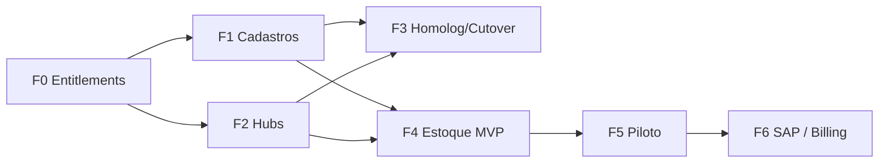

# Plano de desenvolvimento — Hugin Flow (fases)

Documento **mestre** para fasear o que já existe + o que vem a seguir.  
Atualizar checkboxes a cada fechamento de fase.

| | |
|--|--|
| **Atualizado** | 2026-09-11 |
| **Modelo** | App único · Supabase único · Foundation sempre on · módulos on/off (`empresa_addons`) |
| **Prod** | Só com **pedido explícito** ([supabase-prod-deploy-pending.md](./supabase-prod-deploy-pending.md)) |
| **Checkpoint** | `checkpoint/pre-core-2026-09-11` |

### Docs relacionados

| Doc | Papel |
|-----|--------|
| [plataforma-entitlements-decisoes.md](./plataforma-entitlements-decisoes.md) | Decisões congeladas |
| [roadmap-plataforma-entitlements.md](./roadmap-plataforma-entitlements.md) | Detalhe W0–W9 entitlements |
| [plano-modulo-estoque.md](./plano-modulo-estoque.md) | Resumo Estoque (apontador) |
| [desenvolvimento-modulo-estoque.md](./desenvolvimento-modulo-estoque.md) | **Spec de implementação Estoque (F4/F5)** |
| [MIGRACAO-SUPABASE.md](./MIGRACAO-SUPABASE.md) / [supabase-prod-deploy-pending.md](./supabase-prod-deploy-pending.md) | Cutover SQL |

---

## Visão em uma frase

Vender **licença Foundation** (sempre) e **ligar módulos** (Workflow, Omni, Estoque…) conforme o cliente compra — tudo nativo no Hugin, sem embed.

---

## Mapa de fases

```
F0 Foundation/plataforma     ✅ DEV (código + SQL)
F1 Cadastros mestres         ✅ DEV · ⏳ homolog · ⏳ prod (pedido explícito)
F2 Shell / nav hubs          ✅ DEV
F3 Homologação + cutover SQL ⏳ (Cadastros C1–C7 + fases 3–5 se no mesmo release)
F4 Estoque MVP               📋 (proposta Atlas)
F5 Piloto Estoque / go-live  📋
F6 Integrações / billing     📋 (depois)
```

---

## F0 — Plataforma + entitlements

**Objetivo:** catálogo de módulos + liga/desliga por empresa + gates de menu/API.

| Item | Status |
|------|--------|
| `addon_registry` + `empresa_addons` | ✅ DEV |
| Seed: cadastros / workflow / omni / estoque / crm / finops | ✅ DEV |
| Motor `empresaHasAddon` / guards | ✅ código |
| UI Addons (RN3) + ficha empresa | ✅ código |
| API v1 addons | ✅ código |
| E2E entitlements | ⏳ rodar bateria |
| SQL em **prod** | ⏳ pedido explícito (`202609111200`) |

**Saída:** Foundation sempre on; demais módulos controláveis.

Detalhe: [roadmap-plataforma-entitlements.md](./roadmap-plataforma-entitlements.md).

---

## F1 — Cadastros mestres (compartilhados)

**Objetivo:** Pessoas, SKUs (UM/de-para/fiscal), Ativos — base para Estoque e outros módulos.

| Item | Status |
|------|--------|
| Pessoas (`crm_leads` campos) | ✅ DEV |
| SKUs + conversões + de-para | ✅ DEV |
| Reforma fiscal SKU | ✅ DEV |
| Ativos + CC=`departamento_id` | ✅ DEV |
| Locais de estoque | ❌ **não** aqui → F4 |
| Homolog / smoke DEV | ⏳ |
| Pacote SQL C1–C7 em **prod** | ⏳ pedido explícito |

**Migrations:** `202609111200` … `202609111900` (ver pending).

**Saída:** mestres prontos; Estoque só consome SKU/Pessoas/Depto.

---

## F2 — Shell moderno (hubs)

**Objetivo:** sidebar estilo Bifrost — pastas de módulo + hub com cards.

| Item | Status |
|------|--------|
| Pastas: Cockpit, Workflow, Omni, Cadastros, Admin, RN3 | ✅ DEV |
| Hubs + cards filtrados por addon/RBAC | ✅ DEV |
| Subnav SKUs (Catálogo / Conversões / De-para) | ✅ DEV |
| Item ativo (barra inset) | ✅ DEV |
| Pasta **Estoque** | 📋 F4 |

**Saída:** menu não explode; cada módulo novo = pasta + hub.

---

## F3 — Homologação + cutover (gate prod)

**Objetivo:** validar F0–F2 em DEV e, **só com OK explícito**, aplicar SQL/código em prod.

### Checklist DEV
- [ ] Smoke Pessoas / SKUs / Conversões / De-para / Ativos  
- [ ] Smoke hubs + entitlements (módulo off some do menu)  
- [ ] Bateria E2E relevante verde  
- [ ] Commit/release alinhado (sem segredos)

### Cutover prod (quando pedir)
- [ ] Backup  
- [ ] Pacote Cadastros C1→C7  
- [ ] (Opcional no mesmo release) fases 3–5 RBAC/analytics se ainda pendentes  
- [ ] Deploy app  
- [ ] Smoke prod  

**Regra:** não aplicar DDL em prod sem pedido explícito.

---

## F4 — Estoque MVP (nativo)

**Origem:** proposta *Controle de Estoques — Materiais de Uso e Consumo* (Atlas).  
**Detalhe de implementação:** [desenvolvimento-modulo-estoque.md](./desenvolvimento-modulo-estoque.md).

| Subfase | Entrega | Depende |
|---------|---------|---------|
| **F4.0** | Workshop operacional (quem aprova?, atendimento parcial?) — KPIs só anotar | — |
| **F4.1** | Fundação: locais, saldos/movimentos (tabelas), RLS, RBAC, hub operacional, CRUD locais | F1 SKUs |
| **F4.2** | Entrada: lote tela + planilha + XML NFe (motor de validações) | F4.1 + Pessoas/De-para/UM |
| **F4.3** | Requisição (manual + planilha) · param. saldo · prep. workflow aprovação | F4.1 + Pessoas |
| **F4.4** | Retirada + transferência + ajuste (lotes manuais) + atendimento req. (**fim MVP funcional**) | F4.2 + F4.3 |
| **F4.5** | Consultas + export + KPIs (**fora do MVP — depois**) | F4.4 |

**Escopo piloto (proposta):** 1 CNPJ · 2 admins · ~20 usuários departamentais.

**Fora do MVP F4:** SAP/legado, inventário cíclico, MRP.

**Só DEV** até F5 / pedido explícito de prod.

---

## F5 — Piloto Estoque / go-live

| Item | Status |
|------|--------|
| Treino admins + departamentais | 📋 |
| Hiper-care | 📋 |
| Cutover SQL Estoque + código (pedido explícito) | 📋 |
| Addon `estoque` on no tenant | 📋 |
| Critérios de pronto do [desenvolvimento-modulo-estoque.md](./desenvolvimento-modulo-estoque.md) §15 | 📋 |

---

## F6 — Depois do núcleo Estoque

| Tema | Notas |
|------|--------|
| Integração SAP / legado | API-first / webhooks (proposta § integração) |
| Ponte entitlement → `finance_contratos` | Sessão 7 do roadmap plataforma |
| CRM comercial / FinOps | Slugs reservados; sem escopo agora |
| Relatórios por módulo | Card “Relatórios” em cada hub (padrão já previsto) |

---

## Ordem de trabalho sugerida (agora)

| # | Fase | Ação |
|---|------|------|
| 1 | F1/F2 | Fechar smoke DEV Cadastros + hubs |
| 2 | F3 | Homologar; **não** ir a prod sem pedido |
| 3 | F4.0 | Workshop Atlas (1–2 h) |
| 4 | F4.1 | Começar Estoque em **DEV** |
| 5 | F4.2→F4.4 | Operações (MVP funcional) |
| 6 | F4.5 | Consultas/relatórios — depois |
| 6 | F5 | Piloto + cutover sob pedido |

---

## Dependências entre blocos



---

## Legenda

| Símbolo | Significado |
|---------|-------------|
| ✅ | Feito em DEV (ou prod se indicado) |
| ⏳ | Pendente / em curso |
| 📋 | Planejado |
| ❌ | Fora desta fase de propósito |
